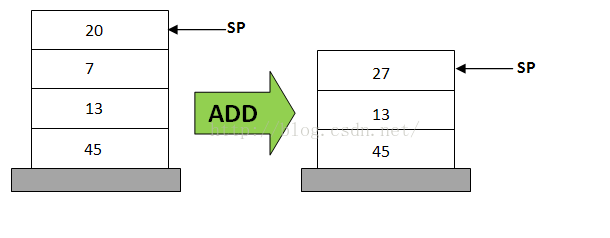
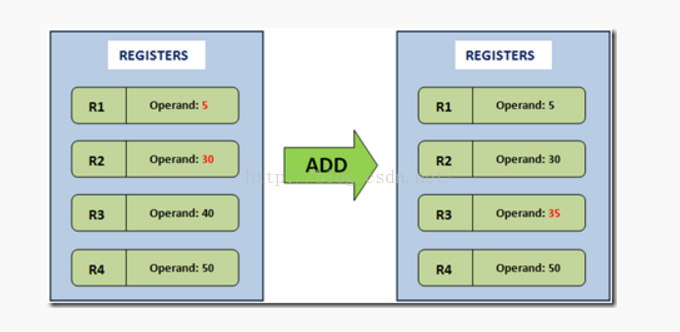

#  HEAD FIRST JVM BYTE CODE

## 0x01

#### Magic Number
+ 文件开头8byte，用于识别文件格式，fast fail
	+ ```*.class```文件：cafe bebe

#### 编译
+ javac: 编译```*.java```文件
	+ 生成```*.class```文件

#### 反编译
+ javap -c: 反编译```*.class```文件，看编译的文件

## 0x02

#### javap -l 看不见 局部变量表
+ 由于编译的时候，未输出相关信息，反编译也无法看到
+ 应该执行```javac -g Hello.java```，然后执行```javap -l Hello```就有了

#### stack based vs register based
虚拟机常见的实现方式有两种：
+ Stack based
	+ 操作数依次压入 stack
	+ 根据执行操作符，pop出相应的数目的值，进行操作
	+ 将结果压入 stack


+ Register based
	+ 操作数直接存入寄存器
	+ 指令明确包含操作数的地址 和 结果存放地址
	+ 执行指令


+ 比较
	+ 基于寄存器的VM没有入栈和出栈的操作
	+ 基于寄存器的VM虚拟机的指令比Stack vm指令要长
	+ 基于栈的VM不需要明确指定参数地址

#### 栈帧
栈帧（Stack Frame）是用于支持虚拟机进行方法调用和方法执行的数据结构，每一个方法执行就代表一个栈帧创建并且压入**虚拟机栈**，每个方法结束就代表一个栈帧弹出
​	+ 创建：随着方法调用而创建
​	+ 销毁：随着方法结束而销毁
​	+ 存储：分配在 Java 虚拟机栈中
​	+ 结构：每个栈帧拥有自己的
​		+ 局部变量表（Local Variables）：编译时确定大小
​		+ 操作数栈（Operand Stack）：编译时确定大小
​		+ 方法返回地址：编译时确定地址
​		+ 指向运行时常量池的引用，包括 动态连接
​		+ 附加信息

+ 局部变量表
	+ 分配
    ​    + 第0位是对象本身，即this的引用
    ​    + 其余参数则按照参数列表的顺序来排列，占用从1开始的局部变量
    ​    + 再根据方法体内部定义的变量顺序和作用域来分配其余
    + 重用
    	+ 方法体中定义的变量，其作用域并不一定会覆盖整个方法，如果当前字节码PC计算器的值已经超出了某个变量的作用域，那么这个变量对应的Slot就可以交给其它变量使用
	+ 在方法执行时，虚拟机是使用局部变量表完成参数变量列表的传递过程
+ 操作数栈
	+ 是一个stack, 先进后出
	+ 最先是空的
	+ 各种字节码指向操作数栈中写入和提取值，也就是入栈与出栈操作
		+ 算术计算通过stack来实现
		+ 调用其它方法的时候是通过操作数栈来行参数传递的
+ 动态连接
	+ 每个栈帧都包含一个指向运行时常量池中该栈帧所属性方法的引用，持有这个引用是为了支持方法调用过程中的动态连接。在Class文件的常量池中存有大量的 符号引用，字节码中的方法调用指令就以常量池中指向方法的符号引用为参数。这些符号引用一部分会在类加载阶段或第一次使用的时候转化为直接引用，这种转化 称为静态解析。另外一部分将在每一次的运行期期间转化为直接引用，这部分称为动态连接。
+ 方法返回地址
	+ 正常返回
		+ 遇到任意返回的字节码指令 (return)
	+ 异常返回
		+ 在本方法的异常表中没有搜索到匹配的异常处理器，导致方法退出
	+ 存储正常返回的地址
+ 附加信息
	+ 具体的虚拟机实现增加的信息，规范里没有描述，这部分信息完全取决于具体的虚拟机实现
	+ 例如与高度相关的信息

#### 二进制查看 class 文件
+ 执行```xxd *.class```文件可以看到对应二进制
	+ 代码
    ```
    public class Get {
        String name;

        public String getName() {
            return name;
        }
    }
    ```
	+ 反编译
	```
	Compiled from "Get.java"
    public class Get {
      java.lang.String name;

      public Get();
        Code:
           0: aload_0
           1: invokespecial #1                  // Method java/lang/Object."<init>":()V
           4: return

      public java.lang.String getName();
        Code:
           0: aload_0
           1: getfield      #2                  // Field name:Ljava/lang/String;
           4: areturn
    }
	```
	+ 反编译后二进制
    ```
    00000000: cafe babe 0000 0034 0016 0a00 0400 1209  .......4........
    00000010: 0003 0013 0700 1407 0015 0100 046e 616d  .............nam
    00000020: 6501 0012 4c6a 6176 612f 6c61 6e67 2f53  e...Ljava/lang/S
    00000030: 7472 696e 673b 0100 063c 696e 6974 3e01  tring;...<init>.
    00000040: 0003 2829 5601 0004 436f 6465 0100 0f4c  ..()V...Code...L
    00000050: 696e 654e 756d 6265 7254 6162 6c65 0100  ineNumberTable..
    00000060: 124c 6f63 616c 5661 7269 6162 6c65 5461  .LocalVariableTa
    00000070: 626c 6501 0004 7468 6973 0100 054c 4765  ble...this...LGe
    00000080: 743b 0100 0767 6574 4e61 6d65 0100 1428  t;...getName...(
    00000090: 294c 6a61 7661 2f6c 616e 672f 5374 7269  )Ljava/lang/Stri
    000000a0: 6e67 3b01 000a 536f 7572 6365 4669 6c65  ng;...SourceFile
    000000b0: 0100 0847 6574 2e6a 6176 610c 0007 0008  ...Get.java.....
    000000c0: 0c00 0500 0601 0003 4765 7401 0010 6a61  ........Get...ja
    000000d0: 7661 2f6c 616e 672f 4f62 6a65 6374 0021  va/lang/Object.!
    000000e0: 0003 0004 0000 0001 0000 0005 0006 0000  ................
    000000f0: 0002 0001 0007 0008 0001 0009 0000 002f  .............../
    00000100: 0001 0001 0000 0005 2ab7 0001 b100 0000  ........*.......
    00000110: 0200 0a00 0000 0600 0100 0000 0100 0b00  ................
    00000120: 0000 0c00 0100 0000 0500 0c00 0d00 0000  ................
    00000130: 0100 0e00 0f00 0100 0900 0000 2f00 0100  ............/...
    00000140: 0100 0000 052a b400 02b0 0000 0002 000a  .....*..........
    00000150: 0000 0006 0001 0000 0005 000b 0000 000c  ................
    00000160: 0001 0000 0005 000c 000d 0000 0001 0010  ................
    00000170: 0000 0002 0011                           ......
    ```
		+ cafe babe: class文件的magic number
		+ 00000140行：2a->aload_0, b4->getfield, b0->areturn
	+ 可见，字节码本身就是代码java的具有逻辑

##### reference
1. [基于栈虚拟机和基于寄存器虚拟机的比较](https://blog.csdn.net/u012481172/article/details/50904574)
2. [java 栈和栈帧](https://www.cnblogs.com/minisculestep/articles/4934947.html)

## 0x03

### For

### Switch
根据switch的匹配值是否相对联系，有2种实现：
+  tableswitch 通过连续的数组表来进行跳转，且会用不存在的case来填充整个table
    对于如下Switch
    ```
    public int chooseNear(int i) {
        switch (i) {
            case 100: return 0;
            case 101: return 1;
            case 104: return 4;
            default: return -1;
        }
    }
    ```
    反编译源码如下：
	```
	0: iload_1
       1: tableswitch   { // 100 to 104
                   100: 36 <-- 匹配值 与 跳转地址
                   101: 38
                   102: 42 <-- 填充default跳转
                   103: 42 <-- 填充default跳转
                   104: 40
               default: 42
          }
      36: iconst_0
      37: ireturn
      38: iconst_1
      39: ireturn
      40: iconst_4
      41: ireturn
      42: iconst_m1
      43: ireturn
	```
	其中跳转的伪代码如下：
	```
	int val = pop();                // pop an int from the stack
	if (val < low || val > high) {  // if its less than <low> or greater than <high>,
		pc += default;              // branch to default 
    } else {                        // otherwise
		pc += table[val - low];     // 由于有填充，可以直接通过下标跳转，branch to entry in table
    }
	```
+ lookupswitch 通过查询来实现跳转
	对于如下Switch
    ```
    public int chooseNear(int i) {
        switch (i) {
            case 100: return 0;
            case 101: return 1;
            case 104: return 4;
            default: return -1;
        }
    }
    ```
    反编译源码如下：
	```
	0: iload_1
       1: tableswitch   { // 100 to 104
                   100: 36 <-- 匹配值 与 跳转地址
                   101: 38
                   102: 42 <-- 填充default跳转
                   103: 42 <-- 填充default跳转
                   104: 40
               default: 42
          }
      36: iconst_0
      37: ireturn
      38: iconst_1
      39: ireturn
      40: iconst_4
      41: ireturn
      42: iconst_m1
      43: ireturn
	```
	其中跳转的伪代码如下：
	```
	int val = pop();                // pop an int from the stack
	if (val < low || val > high) {  // if its less than <low> or greater than <high>,
		pc += default;              // branch to default 
    } else {                        // otherwise
		pc += table[val - low];     // 由于有填充，可以直接通过下标跳转，branch to entry in table
    }
	```


